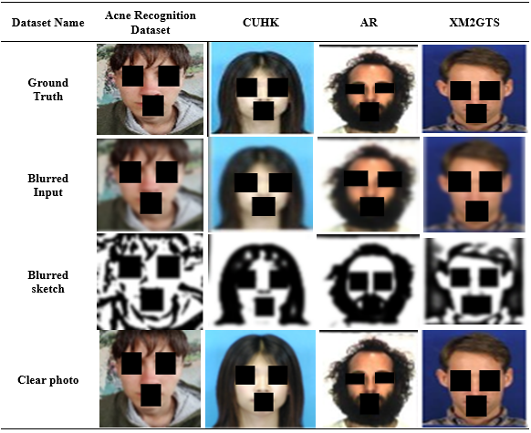

# Improving Acne Severity Detection: A GAN Framework with Contour Accentuation for Image Deblurring.
#### Philomina Princiya Mascarenhas, Sannidhan M S, Ancilla J. Pinto, Dabis Camero, Jason Elroy Martis
We present an GAN-powered image processing framework for enhancing and transforming digital sketches. Our approach  leverages Contour Accentuation Techniques (CAT) and Generative Adversarial Networks (GANs) to effectively enhance and deblur sketch contours, enabling accurate transformations into photo-realistic images.

# Process Flow


# Installation
To install the required libraries, you can use the following command:
```
pip install -r requirements.txt
```
# Module Breakdown
- **Contour Accentuation Technique (CAT):** Enhances image contours through blending and gamma correction techniques.
- **Deblurring Module:** Utilizes GANs to restore blurred facial sketches and improve clarity.
- **Image Translator Module:** Converts sketches into realistic photos while preserving structure and details. 

## Technologies Used
- Python
- TensorFlow
- PyTorch
- GAN-based architectures

## Usage
Clone the repository using 
```bash
git clone https://github.com/Princiya1990/CATDeblurring
```
Verify the folder structure
```
project_root/
├── input_images/
├── output_images/
├── clear_sketches/
├── blurred_sketches/
├── blurred_input/
├── deblurred_output/
├── sketches/
├── images
├── generated_images/
```


1. **For Running CAT:**
   1. Specify the **input_folder** that has the faceimages and the **output_folder** to get the composite sketches.
   2. ```python cat.py```
   3. Adjust gamma in the ```adjust_gamma()``` function for brightness/contrast fine-tuning.
    
2. **For Training the Deblurring Module:**
   1. Place the folder of clear sketches in the root directory of this project. Rename it to ```clear_sketches```
   2. Place the folder of blurred sketches in the root directory of this project. Rename it to ```blurred_sketches```
   3. Run ```python deblurring.py```
   4. The results are present in the ```/code/results``` folder.
   
3. **To Infer and Run the Deblurring Module:**
   
  
4. **To train and run the Image Translator Module**
   1. Go to the Image Translator Module ```cd imagetranslatormodule```
   2. Place your dataset inside the data/CUHK folder (You can modify the folder if required)
   3. Execute ```python sketch_to_image.py```

# Visual Gallery
Here we've shown sample images of the deblurring process across the adopted datasets, transitioning from Ground images to Blurred inputs.



